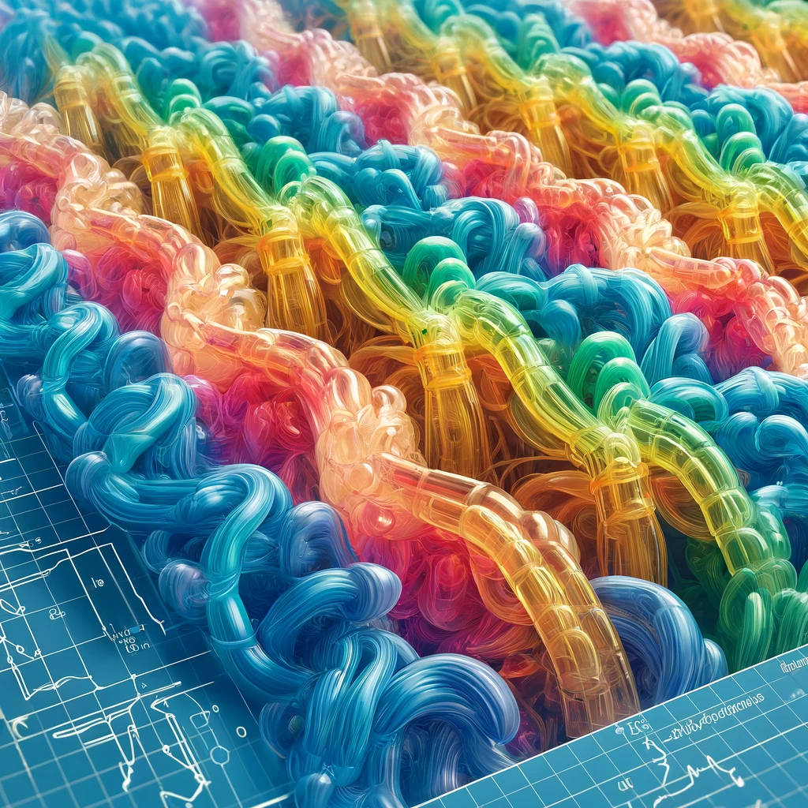
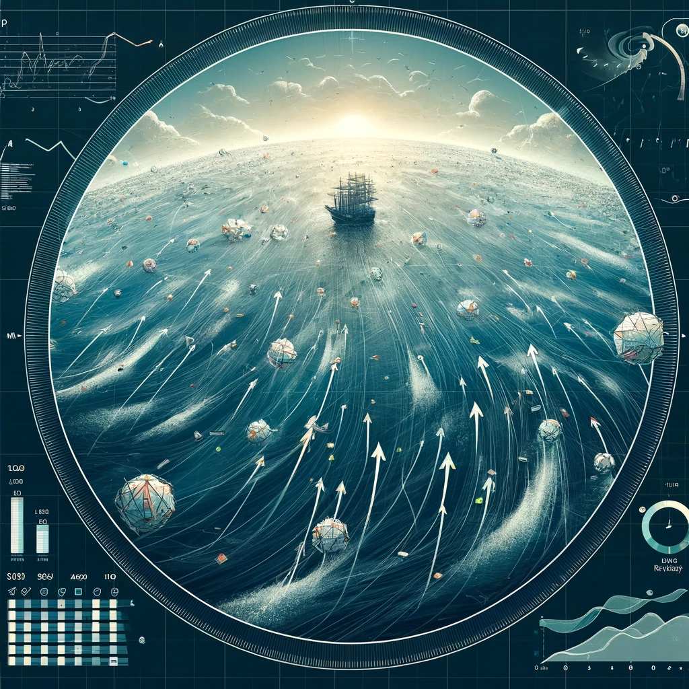

# TMA4320 Introduction to Scientific computing - the projects

Welcome to the repository containing three distinct projects focusing on different domains of science and engineering. Each project is self-contained and addresses unique research questions and methodologies. These projects are from spring 2024.

NB! Notebooks are mostly written in Norwegian

## Projects

### [1. Biophysics: Simulating Polymers using Monte Carlo](Prosjekt1-BioFysikk)

  

**Description:**
This project involves the simulation of polymer chains to study their physical properties and behavior under various conditions. Also includes a focus on runtime and achieving computation efficiency.

**Key Features:**

- Implementation of polymer simulation using Monte Carlo
- Analysis of polymer dynamics and structure
- Visualization of simulation results

**Dependencies:**

- NumPy, Matplotlib

**How to Run:**

1. Navigate to the `Prosjekt1-BioFysikk` directory.
2. Install dependencies: `pip install -r requirements.txt`.
3. Run simulations in the `main.ipynb` notebook.

### [2. Industrial Mathematics: Creating a Transformer from Scratch](Prosjekt2-IndustriellMatematikk)

**Description:**
This project involves the implementation of a Transformer neural network from scratch, focusing on the underlying mathematical principles and efficient computation.

**Key Features:**

- Custom implementation of the Transformer architecture
- Example datasets and pre-processing scripts
- Mathematical foundation described along the way

**Dependencies:**

- NumPy, Matplotlib

**How to Run:**

1. Navigate to the `Prosjekt2-IndustriellMatematikk` directory.
2. Install dependencies: `pip install -r requirements.txt`.
3. Open the: `main.ipynb` file and run the cells.

### [3. Technical Physics: Modeling Sea Debris Trajectories](Prosjekt3-TekniskFysikk)

**Description:**
This project models the trajectories of sea debris based on meteorological data, predicting where debris will float.

**Key Features:**

- Ingestion and processing of meteorological data.
- Simulation of debris trajectories.
- Visualization of predicted debris paths.
- Numerical approximation using Heun's method

**Dependencies:**

- NumPy, Matplotlib, scipy, xarray, cartopy

**How to Run:**

1. Navigate to the `Prosjekt3-TekniskFysikk` directory
2. Install dependencies: `pip install -r requirements.txt`
3. Run the: `main.ipynb` notebook

## License

This repository is licensed under the MIT License. See the [LICENSE](LICENSE) file for more details.

## Authors

This project is developed by the following authors:

- [Tor Ludvig Haugen](https://github.com/tlhaugen)
- [Trym Erlend Bakkeland Lervik](https://github.com/EttMolTrym)
- [Vilhjalmur Arnar Vilhjalmsson](https://github.com/villi02)
